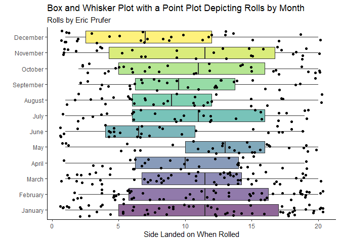
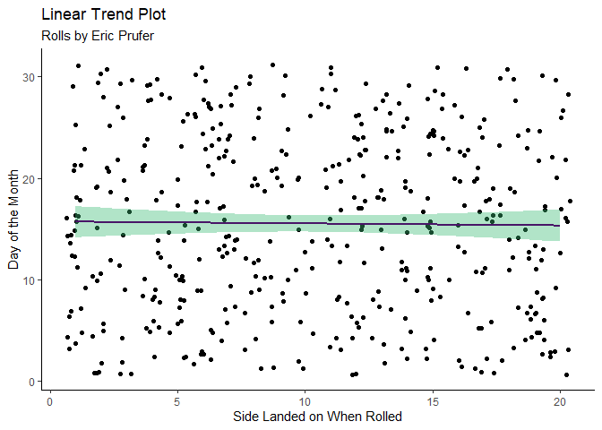

Dice Rolls
================
Kit Applegate
4/4/2022

# Analysis of Daily Dice Rolls Over Two Year Period

Rolls by Eric Prufer

## Distribution

First, the distribution was examined. As observed, it is pretty even
across all days of the week.

<!-- -->

There is more variation across months as observed in the plot below.

<!-- -->

Here we observe the number of times a side was rolled. On a d20 the
values of each number are weighted the same. Unlike, for example, a 2d6
is inherently higher weighted to roll certain sides. We can observe
there is not a pattern forming across each of the sides.

<!-- -->

## Linear Trend

Last, we can observe no linear trend. Meaning it is observed as random.
There have been studies of the actual randomness of physical dice rolls.
One study mentioned in *Inside Science* “Dice Rolls are Not Completely
Random”, indicates surface, which number is face up on the dice and a
number of other factors can influence the outcome of the roll. For the
sake of the non-scientific nature and the difficultly the regression
model had predicting the outcome of the rolls, the conclusion is that it
is random (enough) for us to say it is random.

<!-- -->

Updated: 04/04/2022 at 1950

*Dice rolls are not completely random.* Inside Science. (n.d.).
Retrieved April 4, 2022, from
<https://www.insidescience.org/news/dice-rolls-are-not-completely-random>
